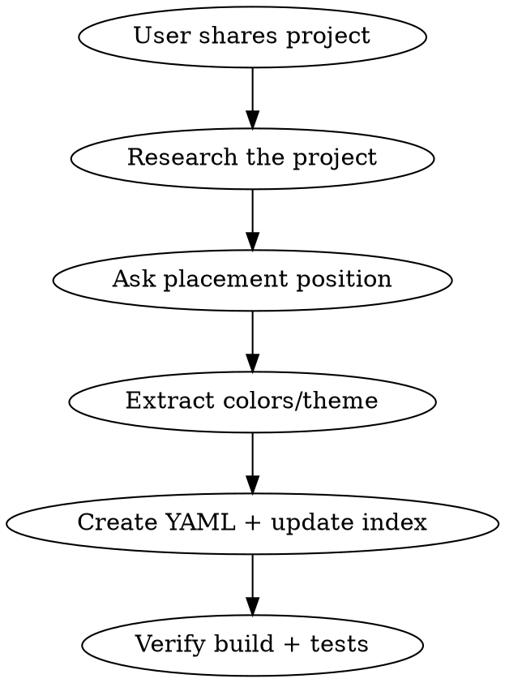

# Add Project

Add a project to crog.gg's projects page (`/projects`). What each field does, and its gotchas: `documentation/CONTENT.md`.

## Workflow



### 1. Research the Project

Gather project details WITHOUT adding bloat. Be surgical:

- **If a repo path is given**: Read `README.md` and `package.json` (or equivalent manifest). Check `git remote -v` for the GitHub URL. Skim 2-3 key source files to understand what it does. Stop there.
- **If only a URL is given**: Use browser tools to read the page, or ask the user for a repo path.
- **Do NOT** recursively explore every directory, read every file, or run the project locally. Get what you need and move on.

Collect:
- Project name and short description (casual, lowercase tone per CLAUDE.md)
- Technologies used (pick the 3-4 most important - only first 3 render on the card)
- Primary URL (the live app or landing page)
- GitHub URL (if available)
- Category: `web-app`, `ai-tools`, `native-app`, `data-science`, or `open-source`

### 2. Ask Placement Position

Ask the user: **"Which position should this go in? Currently: [list the projects in `index.yaml`'s order]"**

Do NOT assume position. Always ask.

### 3. Extract Colors and Theme

Pull the project's visual identity for the card gradient:

- **If the project has a landing page**: Use browser tools or read the source CSS/config to find the primary brand color.
- **If the project has a repo**: Check for tailwind config, CSS variables, theme files, or prominent hex colors in the source.
- **Fallback**: Ask the user for a color, or pick something that fits the project's vibe.

Build a gradient: `"linear-gradient(135deg, <primary> 0%, <dark-variant> 100%)"`

The dark variant is usually a much darker shade or `#1a1a2e` for good contrast.

### 4. Pick an Icon

Pick one emoji, written as a YAML escape (e.g. `icon: "\U0001F680"` for a rocket). The card renders `icon` as plain text and no icon font is loaded, so an icon-font class name would print as literal text. The existing project YAMLs all use this form.

Match the icon to the project's core function, not its tech stack.

### 5. Create YAML and Update Index

**Project YAML** at `site/public/content/projects/<id>.yaml`:

```yaml
# Project Name - Short Tagline
id: project-id
title: Project Name
description: |
  lowercase casual description of what the project does.
  keep it to 2-3 lines max - card clamps to 2 lines anyway.
url: https://example.com
icon: "\U0001F680"
category: web-app
technologies:
  - Tech1
  - Tech2
  - Tech3
status: active
gradient: "linear-gradient(135deg, #color1 0%, #color2 100%)"
```

The site checks every project file as it loads (#190): a field it doesn't know (`order`, `featured`, `tags` and `image` are gone) fails the build, naming the file and the key. Which project is featured is `index.yaml`'s call (below).

Optional fields (add only if available):
- `github: https://github.com/<owner>/<repo>`: only for a public repo owned by the site's GitHub owner (`github.username` in `site/site.yaml`) or one of its `allowed_owners`; leave it out for anyone else's repo, since the API serves no one else's. The same goes for a `url` on github.com: without `github`, the page reads `url` as the repo, so point another owner's project at its site, not its repo.
- `card` (only if the user wants the project's page to have its own link preview; most use the site's): `path` (a 1200x630 PNG in `site/public/`), `width`, `height`, and `alt`, the card's words. Render it from `site/<name>.html` with `node scripts/og-image/render.mjs` (from `frontend/`); `npm run site:check` holds the PNG to its size and the alt to the source's words.
- `demo: https://...` (only if different from `url`): the project page embeds it, and the site's Content-Security-Policy blocks frames from hosts it doesn't list. Add its exact origin to `frame-src` in `vercel.json` in the same PR (no wildcards), and say in the PR that it loosens the CSP. A demo this site serves can't be embedded: every path sends `X-Frame-Options: DENY`, so make it the `url` instead.

**Update `site/public/content/projects/index.yaml`**:
- Insert the new filename at the chosen position: the list's order is the order the site shows them in, and nothing else sets it.
- Leave `featured` alone unless the user asks to feature the new project: it names the one file shown first and larger on `/` and `/projects`, so featuring this one unfeatures the current one.

### 6. Verify

Run `cd frontend && npm run build` and `npm run test:run`. Both must pass.

## Quick Reference

| Field | Required | Notes |
|-------|----------|-------|
| id | Yes | Lowercase kebab-case |
| title | Yes | Display name |
| description | Yes | Casual, lowercase, 2-3 lines |
| url | No | Primary link, https (fallback: url > demo > github) |
| icon | Yes | One emoji, as a YAML escape (shown as plain text) |
| category | Yes | web-app, ai-tools, native-app, data-science, open-source |
| technologies | No | Top 3-4 (only 3 shown on card) |
| gradient | No | CSS gradient behind the card's icon, defaults to gray |
| card | No | The page's own link preview: path, width, height, alt (see step 5) |
| status | No | active, archived, experimental |
| github | No | A public repo of the configured GitHub owner (see step 5) |
| demo | No | Only if it differs from `url`; needs a `frame-src` entry (see step 5) |

## Common Mistakes

- **Overexploring the repo**: You need name, description, tech, colors. Don't read every file.
- **Leaving it out of `index.yaml`**: a file the index doesn't list is shown nowhere.
- **Corporate tone in description**: Keep it lowercase and casual. No em-dashes.
- **Too many technologies**: Card only renders 3. Pick the most important ones first.
- **Skipping the gradient**: A gray icon chip looks lazy. Always try to pull a color.
