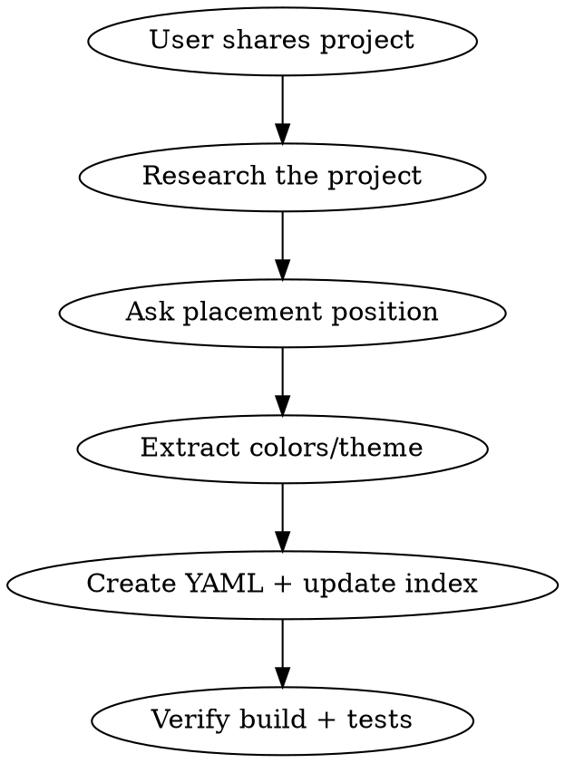

# Add Project

Add a project to the choose-your-own-chris portfolio site.

## Workflow



### 1. Research the Project

Gather project details WITHOUT adding bloat. Be surgical:

- **If a repo path is given**: Read `README.md` and `package.json` (or equivalent manifest). Check `git remote -v` for the GitHub URL. Skim 2-3 key source files to understand what it does. Stop there.
- **If only a URL is given**: Use browser tools to read the page, or ask the user for a repo path.
- **Do NOT** recursively explore every directory, read every file, or run the project locally. Get what you need and move on.

Collect:
- Project name and short description (casual, lowercase tone per CLAUDE.md)
- Technologies used (pick the 3-4 most important - only first 3 render on the card)
- Primary URL (the live app or landing page)
- GitHub URL (if available)
- Category: `web-app`, `ai-tools`, `native-app`, `data-science`, or `open-source`

### 2. Ask Placement Position

Ask the user: **"Which position should this go in? Currently: [list current projects by order]"**

Do NOT assume position. Always ask.

### 3. Extract Colors and Theme

Pull the project's visual identity for the card gradient:

- **If the project has a landing page**: Use browser tools or read the source CSS/config to find the primary brand color.
- **If the project has a repo**: Check for tailwind config, CSS variables, theme files, or prominent hex colors in the source.
- **Fallback**: Ask the user for a color, or pick something that fits the project's vibe.

Build a gradient: `"linear-gradient(135deg, <primary> 0%, <dark-variant> 100%)"`

The dark variant is usually a much darker shade or `#1a1a2e` for good contrast.

### 4. Pick an Icon

Use FontAwesome classes. Browse existing projects for examples:
- `fas fa-*` for solid icons
- `fab fa-*` for brand icons (GitHub, Telegram, etc.)

Match the icon to the project's core function, not its tech stack.

### 5. Create YAML and Update Index

**Project YAML** at `frontend/public/content/projects/<id>.yaml`:

```yaml
# Project Name - Short Tagline
id: project-id
title: Project Name
description: |
  lowercase casual description of what the project does.
  keep it to 2-3 lines max - card clamps to 2 lines anyway.
url: https://example.com
icon: fas fa-icon-name
category: web-app
technologies:
  - Tech1
  - Tech2
  - Tech3
featured: true
order: <chosen position>
status: active
gradient: "linear-gradient(135deg, #color1 0%, #color2 100%)"
tags:
  - relevant
  - tags
```

Optional fields (add only if available):
- `github: https://github.com/...`
- `demo: https://...` (if different from url)

**Update `frontend/public/content/projects/index.yaml`**:
- Insert the new filename at the correct position in the list

**Bump order numbers**:
- Every existing project with `order >= chosen position` gets incremented by 1
- The `github.yaml` project uses `order: 99` - leave it alone

### 6. Verify

Run `cd frontend && npm run build` and `npm run test:run`. Both must pass.

## Quick Reference

| Field | Required | Notes |
|-------|----------|-------|
| id | Yes | Lowercase kebab-case |
| title | Yes | Display name |
| description | Yes | Casual, lowercase, 2-3 lines |
| url | Yes | Primary link (fallback: url > demo > github) |
| icon | Yes | FontAwesome class |
| category | Yes | web-app, ai-tools, native-app, data-science, open-source |
| technologies | Yes | Top 3-4 (only 3 shown on card) |
| order | Yes | Position number |
| gradient | No | CSS gradient for card header, defaults to gray |
| featured | No | Defaults to false |
| status | No | active, archived, experimental |
| github | No | GitHub repo URL |
| tags | No | Metadata tags |

## Common Mistakes

- **Overexploring the repo**: You need name, description, tech, colors. Don't read every file.
- **Forgetting to bump orders**: Every project at or after the insertion point needs +1.
- **Corporate tone in description**: Keep it lowercase and casual. No em-dashes.
- **Too many technologies**: Card only renders 3. Pick the most important ones first.
- **Skipping the gradient**: A gray default card looks lazy. Always try to pull a color.
